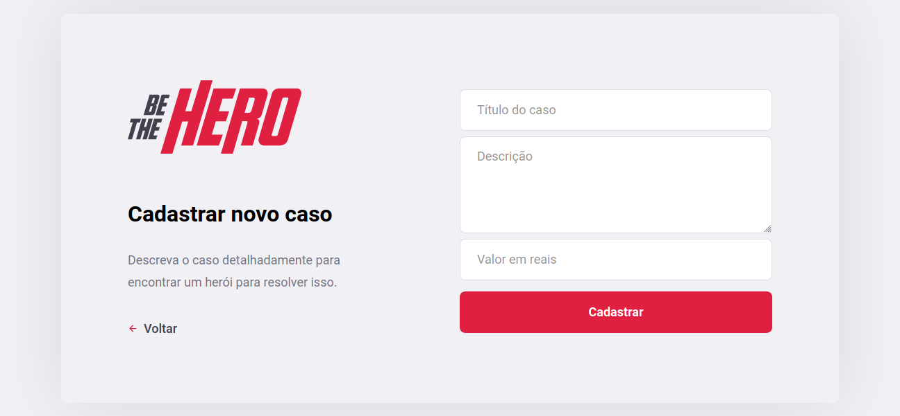

<h1>Be The Hero</h1>

<div align="center">
    
    <p>
        Cadastre ONGs e permita que elas divulguem suas causas em busca de heróis!
    </p>
    <div>
        <a href="#tecnologias">Tecnologias</a>
        &nbsp;&nbsp;&nbsp;|&nbsp;&nbsp;&nbsp;
        <a href="#desenvolvimento">Desenvolvimento</a>
        &nbsp;&nbsp;&nbsp;|&nbsp;&nbsp;&nbsp;
        <a href="#integracao">Integração</a>
        &nbsp;&nbsp;&nbsp;|&nbsp;&nbsp;&nbsp;
        <a href="#telas">Telas</a>
        &nbsp;&nbsp;&nbsp;|&nbsp;&nbsp;&nbsp;
        <a href="#creditos">Créditos</a>
    </div>
</div>


<h2 id="tecnologias">Tecnologias</h2>

+ [React](https://pt-br.reactjs.org/)


<h2 id="desenvolvimento">Desenvolvimento</h2>


```
$ npm install
```

```
$ npm start
``` 


<h2 id="integracao">Integração</h2>

API para utilização do site está disponível no repositório [Be The Hero - Backend](https://github.com/amandabezerra/be-the-hero-backend).


<h2 id="telas">Telas</h2>





<h2 id="creditos">Créditos</h2>

Este projeto foi produzido a partir de vídeos e materiais da Semana Omnistack 11 da [Rocketseat](https://rocketseat.com.br/).